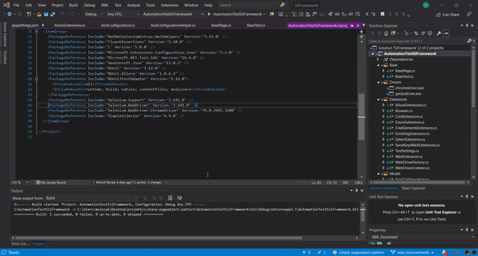
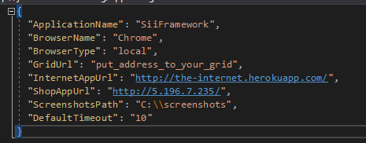

## Selenium Test Framework  
This project provides a library for Web UI automation tests based on Selenium WebDriver. It is written in C# and it follows best practices as well as most recent 
and top-rated tools. It is designed for web test automation, to implement and run robust functional tests.  
Since everything is set up, the tests can be added and run straight away.
 
## Framework Features:
* follows page object pattern 
* parallel test execution ready
* full control by annotations
* most popular browsers preconfigured
* configurability by configuration .json file
* pretty and highly readable test result report
* easy for extension and customization
* screenshots automatically added to report (in every action and attached to Allure report)
* easily integrate with selenium grid

## Run tests from this repo

Run 
```  
dotnet test
```  
(in your console in path with .csproj) you need to have .NET Core on your computer


## Use this project 

For now, you can pull and take this project AutomationTestsSiiFramework. In two projects AutomationTestSiiFramework.Tests.TheInternet and AutomationTestSiiFramework.Tests.Shop. Put it to your repository and start using it. 
In the feature, we will add NuGet package and documentation. It will be easier to use in daily life.


## appsettings.json - possible to change default values

 

For using parameters you can change values in appsettings.json file. Each of the projects in this solution has own appsettings.json.

 

## Supported browsers
- Chrome
- Firefox
- InternetExplorer
- Edge

## Edge prerequisites
1. Enable developer mode in Windows:
- Open windows settings → Update & Security → For Developers → select “Developer mode”

2. Install EdgeDriver
- Open windows settings → App & features → Manage optional features → Add a feature → Add option "Microsoft WebDriver"

## Allure Report
After run tests, you can generate a report from your tests. First of all, you need to have "Allure Commandline" on your computer (Go to the documentation https://docs.qameta.io/allure/#_installing_a_commandline)

Allure framework generates allure-results directory where we have results from our tests. You need to go to the folder where you're run tests. In this path run by cmd or PowerShell:
```  
allure serve
```  
 

You need to have installed Allure on your machine.

## NuGet 
We will add in the future NuGet package and documentation for it.